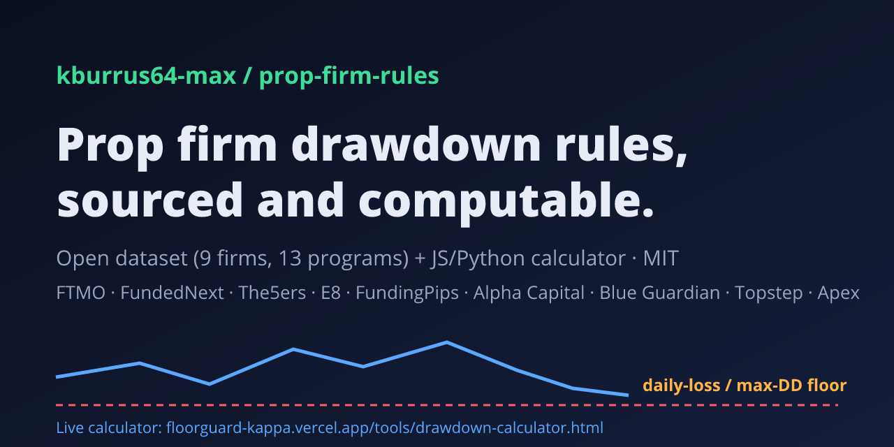

# prop-firm-rules: prop firm drawdown rules dataset + calculator (JS & Python)

**▶ Live calculator (free, no sign-up, runs in your browser): [floorguard-kappa.vercel.app/tools/drawdown-calculator.html](https://floorguard-kappa.vercel.app/tools/drawdown-calculator.html)**



An open, **sourced** dataset of prop-firm risk rules (daily loss limit, max drawdown, static vs trailing, lock level,
daily reset time) for **FTMO, FundedNext, The5ers, E8 Markets, FundingPips, Alpha Capital, Blue Guardian, Topstep and
Apex Trader Funding**, plus a tiny zero-dependency **drawdown calculator** library in JavaScript and Python.

Every rule links to the firm's own help or rules page and carries a `lastVerified` date. Values that could not be
confirmed on an official page are flagged `verified: false` or listed in `unverifiedFields`.

**Try it without code:** the free [prop firm drawdown calculator](https://floorguard-kappa.vercel.app/tools/drawdown-calculator.html)
on FloorGuard uses this same dataset and math in your browser.

> **Disclaimer: rules change.** Prop firms update their rules often, and many let you pick different percentages
> at checkout. This data was checked on the date shown for each program. **Always verify with your firm's current
> rules and your account dashboard before relying on any number here.** Not affiliated with any prop firm; firm
> names are trademarks of their owners. Not financial advice.

## Rules table (last verified 2026-10-04)

| Firm | Program | Daily loss limit | Max drawdown | Daily reset | Source | Verified |
|---|---|---|---|---|---|---|
| FTMO | FTMO Challenge 2-Step | 5% of initial balance, from day-start balance | 10%, Static | 00:00 CE(S)T (Prague) | [1](https://ftmo.com/en/trading-objectives/) [2](https://academy.ftmo.com/lesson/maximum-daily-loss/) [3](https://academy.ftmo.com/lesson/maximum-loss/) | 2026-10-04 |
| FTMO | FTMO Challenge 1-Step | 3% of initial balance, from day-start balance | 10%, Trailing (end-of-day) | 00:00 CE(S)T (Prague) | [1](https://ftmo.com/en/trading-objectives/) | 2026-10-04 |
| FundedNext | Stellar 2-Step (CFD) | 5% of initial balance, from day-start balance | 10%, Static | 00:00 server time (GMT+2, GMT+3 in DST) | [1](https://help.fundednext.com/en/articles/8019811-how-can-i-calculate-the-daily-loss-limit) [2](https://help.fundednext.com/en/articles/8019812-how-can-i-calculate-the-maximum-loss-limit) [3](https://fundednext.com/general-rules/cfds/trading-objectives) | 2026-10-04 |
| The5ers | High Stakes (2-Step) | 5% of higher of day-start balance/equity | 10%, Static | 00:00 MT5 server time (GMT+2 winter, GMT+3 summer) | [1](https://help.the5ers.com/what-is-the-maximum-loss-and-the-maximum-daily-loss-in-the-high-stakes-program/) [2](https://help.the5ers.com/what-are-the-general-rules-for-the-high-stakes-program/) | 2026-10-04 |
| E8 Markets | E8 One (default 4% daily / 6% dynamic) | 4% of initial balance, from day-start balance | 6%, Trailing (closed balance), locks at initial | 00:00 server time (time zone not stated on the page) | [1](https://help.e8markets.com/en/articles/11769446-daily-drawdown) [2](https://help.e8markets.com/en/articles/11782996-dynamic-drawdown) | 2026-10-04 (unverified: reset time zone) |
| FundingPips | 2 Step Standard (5% daily) | 5% of higher of day-start balance/equity | 10%, Static | 00:00 platform time (UTC+3) | [1](https://help.fundingpips.com/hc/en-us/articles/34501809112081-2-Step-Standard) | 2026-10-04 |
| FundingPips | 2 Step Standard (3% daily add-on) | 3% of higher of day-start balance/equity | 10%, Static | 00:00 platform time (UTC+3) | [1](https://help.fundingpips.com/hc/en-us/articles/34501809112081-2-Step-Standard) | 2026-10-04 |
| Alpha Capital | Alpha Pro 10% | 5% of day-start balance | 10%, Static | 00:00 GMT+3 (broker time) | [1](https://help.alphacapitalgroup.uk/en/articles/6934210-what-are-the-daily-risk-limits-and-how-do-they-work) [2](https://help.alphacapitalgroup.uk/en/articles/8420429-alpha-pro-8-10) [3](https://help.alphacapitalgroup.uk/en/articles/6934220-what-is-the-maximum-total-loss) | 2026-10-04 |
| Alpha Capital | Alpha Pro 8% | 4% of day-start balance | 8%, Static | 00:00 GMT+3 (broker time) | [1](https://help.alphacapitalgroup.uk/en/articles/6934210-what-are-the-daily-risk-limits-and-how-do-they-work) [2](https://help.alphacapitalgroup.uk/en/articles/8420429-alpha-pro-8-10) | 2026-10-04 |
| Blue Guardian | 2 Step Standard | 4% of initial balance, from higher of day-start balance/equity | 8%, Static | 5:00 pm EST (New York) | [1](https://help.blueguardian.com/en/articles/14062291-2-step-standard-rules) | 2026-10-04 |
| Topstep | Trading Combine (futures) | None (see notes) | $2,000 on 50K, $3,000 on 100K, $4,500 on 150K, Trailing (end-of-day), locks at initial | End of trading day; Topstep's session is commonly cited as ending 3:10 pm CT / new day 5:00 pm CT (not confirmed on an official page) | [1](https://help.topstep.com/en/articles/8284204-what-is-the-maximum-loss-limit) [2](https://help.topstep.com/en/articles/10490293-daily-loss-limit-in-the-trading-combine-and-express-funded-account) | 2026-10-04 (unverified: reset time) |
| Apex Trader Funding | EOD Evaluation (futures) | $500 on 25K, $1,000 on 50K, $1,500 on 100K, $2,000 on 150K (pauses trading, not a breach) | $1,000 on 25K, $2,000 on 50K, $3,000 on 100K, $4,000 on 150K, Trailing (end-of-day) | Trading day resets 6:00 pm ET | [1](https://apextraderfunding.com/help-center/eod-trailing-drawdown-accounts/eod-evaluations/) | 2026-10-04 |
| Apex Trader Funding | Intraday Trailing Evaluation (futures) | None (see notes) | $1,000 on 25K, $2,000 on 50K, $3,000 on 100K, $4,000 on 150K, Trailing (intraday, incl. open P/L) | Threshold does not reset daily | [1](https://apextraderfunding.com/help-center/intraday-trailing-drawdown-accounts/intraday-trailing-drawdown-explained/) | 2026-10-04 |

"Day-start" means the value at the firm's daily reset. "Higher of day-start balance/equity" means open profit at the
reset raises the reference. Every limit is checked against **equity** (open P/L counts) unless the notes say otherwise.
Per-program notes (for example Topstep's optional daily loss limit, Apex lock behaviour, Blue Guardian's Guardian
Shield) are in [`data/firms.json`](data/firms.json).

The dataset also includes each firm's published **copy-trading, multi-account and automation (EA/bot) policy**
(`policy` on each firm), with quotes and sources. `unknown` means the firm's pages did not answer the question.

## What's in the repo

| Path | What |
|---|---|
| [`data/firms.json`](data/firms.json) | The dataset (9 firms, 13 programs). Same content as [`data/firms.yaml`](data/firms.yaml) |
| [`js/calc.mjs`](js/calc.mjs) | Pure calculator, works in browsers and Node (no DOM, no deps) |
| [`js/index.mjs`](js/index.mjs) | Node entry: calculator + bundled dataset + `getProgram`, `getFirm`, `check` helpers |
| [`python/prop_firm_rules/`](python/prop_firm_rules/__init__.py) | Python port with the same semantics (stdlib only) |
| `js/test/`, `python/tests/` | Tests built mostly from the firms' own published worked examples |
| [`scripts/rules-table.mjs`](scripts/rules-table.mjs) | Regenerates the table above |

## Usage

### JavaScript (Node 18+)

```bash
git clone https://github.com/kburrus64-max/prop-firm-rules && cd prop-firm-rules
node --test js/test/
```

```js
import { check, getFirm } from './js/index.mjs';

// FTMO 2-Step, $100k: balance closed yesterday at $102,000, equity now $101,200
const r = check('ftmo_2step', {
  size: 100000, currentBalance: 102000, currentEquity: 101200, todayPnl: -800,
  stopDistance: 20, valuePerUnit: 10, bufferPct: 10,   // 20-pip stop, $10/pip/lot, keep 10% buffer
});
console.log(r.daily.floor, r.daily.room);       // 97000 4200
console.log(r.drawdown.floor);                  // 90000 (static)
console.log(r.maxLots, r.bindingLimit, r.status); // 18.5 'daily' 'green'

console.log(getFirm('topstep').policy.remoteServerTrading); // 'banned'
```

In the browser, import `js/calc.mjs` and `fetch` `data/firms.json`:

```js
import { evaluate } from './calc.mjs';
const data = await (await fetch('/data/firms.json')).json();
const program = data.firms.find(f => f.id === 'topstep').programs[0];
evaluate({ program, size: 50000, currentBalance: 50000, currentEquity: 50000, highWaterMark: 50500 }).drawdown.floor; // 48500
```

### Python 3.9+

```python
import sys; sys.path.insert(0, "python")
import prop_firm_rules as pfr

r = pfr.check("apex_intraday_eval", size=50000, current_balance=50000, current_equity=50900, today_pnl=900)
print(r["drawdown"]["floor"])   # 48900.0: the threshold trailed the open-profit peak
```

```bash
python -m unittest discover -s python/tests
```

### `evaluate()` inputs and outputs

| Input | Meaning |
|---|---|
| `program` / program id | A program object from the dataset (or an id for `check`) |
| `size`, `initial` | Account size and starting balance (`initial` defaults to `size`) |
| `currentBalance`, `currentEquity` | Now. The lower of the two is compared with each floor (conservative) |
| `todayPnl` | Change in equity since the firm's daily reset (closed + open) |
| `dayStartBalance`, `dayStartEquity` | Values at the reset (optional; derived from `todayPnl` if omitted) |
| `highWaterMark` | The high a trailing drawdown trails from (EOD balance, closed balance, or intraday peak) |
| `customDailyAmount` | Your own daily limit for programs without a mandatory one (e.g. Topstep's optional add-on) |
| `stopDistance`, `valuePerUnit`, `lotStep`, `bufferPct` | Position-size check: largest size whose stop-out keeps you above the tighter floor |

Output: `daily` and `drawdown` (`floor`, `room`, `amount`, `status`), `maxLots`, `bindingLimit` and an overall
`status` of `green` (more than 50% of each allowance left), `amber` (50% or less) or `red` (20% or less, or breached).

Python uses the same names in snake_case (`current_balance`, `high_water_mark`, ...).

## Use from AI agents

The same dataset is served live, free and read-only (no key, CORS open, ~60 requests/minute per IP) by FloorGuard:

- **MCP server** (Streamable HTTP, no auth): `https://floorguard-kappa.vercel.app/api/mcp`
  - Tools: `list_firms`, `get_rules(program)`, `check_drawdown(program, accountSize, currentEquity, ...)`
  - Listed in the official [MCP Registry](https://registry.modelcontextprotocol.io/v0/servers?search=prop-firm-rules) as `io.github.kburrus64-max/prop-firm-rules` (see [`server.json`](server.json)).
  - Client config example: `{"mcpServers": {"prop-firm-rules": {"type": "http", "url": "https://floorguard-kappa.vercel.app/api/mcp"}}}`
- **REST API**: [`/api/v1/firms`](https://floorguard-kappa.vercel.app/api/v1/firms), [`/api/v1/rules?program=ftmo_2step`](https://floorguard-kappa.vercel.app/api/v1/rules?program=ftmo_2step), [`/api/v1/check`](https://floorguard-kappa.vercel.app/api/v1/check?program=ftmo_2step&accountSize=100000&currentEquity=96500&todayPnl=-3000); OpenAPI 3.1 at [`/api/v1/openapi.json`](https://floorguard-kappa.vercel.app/api/v1/openapi.json).
- **A2A agent card**: [`/.well-known/agent-card.json`](https://floorguard-kappa.vercel.app/.well-known/agent-card.json)
- **llms.txt**: [`/llms.txt`](https://floorguard-kappa.vercel.app/llms.txt)

Informational only, not financial advice; verify every value with the firm.

## Static vs trailing drawdown in 30 seconds

- **Static:** the floor is fixed at initial balance minus the allowance (FTMO 2-Step: $90,000 on $100k).
- **Trailing end-of-day:** the floor follows your highest end-of-day balance (Topstep MLL, FTMO 1-Step, Apex EOD).
- **Trailing closed balance:** follows your highest closed balance (E8 dynamic drawdown).
- **Trailing intraday:** follows your peak including **open** profit, in real time (Apex intraday).
- **Lock:** some trailing floors stop rising at a level such as the starting balance (Topstep, E8).

Longer explanations with sources: [trailing vs static drawdown](https://floorguard-kappa.vercel.app/guides/trailing-vs-static-drawdown.html),
[FTMO daily loss rule](https://floorguard-kappa.vercel.app/guides/ftmo-daily-loss-rule.html),
[same 5% daily loss, different math](https://floorguard-kappa.vercel.app/guides/daily-loss-limit-comparison.html).

## Corrections welcome

Found a rule that changed? Open an issue with the firm's official URL and the quoted text (see
[CONTRIBUTING.md](CONTRIBUTING.md)). Please don't submit values without an official source.

## Limitations

- Commissions, swaps, slippage and server-side rounding are not modelled; firms' platforms can differ by a few dollars.
- Account-size lists marked `sizesVerified: false` were not confirmed on an official page.
- Programs with features this model does not cover (e.g. Blue Guardian funded-account Guardian Shield, consistency rules,
  news restrictions, payout rules) are noted in `notes` but not calculated.

## License

[MIT](LICENSE). The dataset is a compilation of facts from the firms' public pages, with links back to them.
Built by the team behind [FloorGuard](https://floorguard-kappa.vercel.app/), a prop-account risk guard in development.
